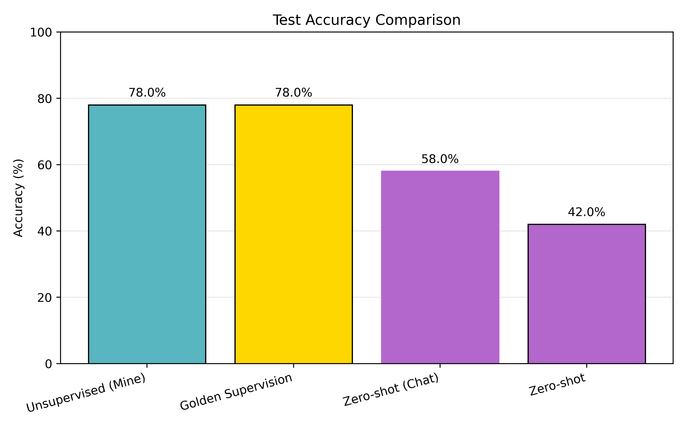

# Unsupervised Elicitation with vLLM Self-Hosting

This repository is a fork of [Jiaxin-Wen/Unsupervised-Elicitation](https://github.com/Jiaxin-Wen/Unsupervised-Elicitation) which implements ICM (introduced in https://alignment.anthropic.com/2025/unsupervised-elicitation/). This fork refactors the code to use vLLM, which downloads and self-hosts the base model directly within the Python script (no separate server deployment required and no API calls required for ICM) and uses a subset of the data used in the original paper to essentially replicate the results of figure 1 in the paper. 

## Results

<p align="center">
  
</p>

**Llama 3.1 8B on TruthfulQA** - The unsupervised ICM algorithm achieves **78% accuracy**, matching fully supervised training (Golden Supervision), and significantly outperforming:
- Zero-shot Chat (instruction-tuned model): 58%
- Zero-shot Base (pretrained model): 42%

## What's New in This Fork

### vLLM Self-Hosting
This fork refactors the code to use vLLM, which downloads and self-hosts the base model directly within the Python script (no separate server deployment required and no API calls required for ICM)

### Comprehensive Baselines
The main script now runs four evaluation modes in a single script-ICM.py:
1. **ICM (Unsupervised)** - The core algorithm: Internal Coherence Maximization; uses model-generated labels for many-shot in-context learning with the base model
2. **Golden Supervision** - Uses ground truth labels for many-shot in-context learning with the base model
3. **Zero-shot Chat** - zero-shot inference with the instruction-tuned model (via Together AI API)
4. **Zero-shot Pretrained** - zero-shot inference with the base model

### Additional Changes
- Graceful engine shutdown to prevent GPU memory leaks
- Performance plotting that generates `figure_1.png` after each run
- Together AI integration for serverless chat model inference

## Quick Start

### Prerequisites
- Python 3.9+
- CUDA 11.8+ or 12.1+
- GPU(s) with sufficient memory
- HuggingFace account with Llama model access

### Installation

```bash
# Clone and setup
git clone https://github.com/ijamil1/Unsupervised-Elicitation.git
cd Unsupervised-Elicitation


# Create environment and install
python3 -m venv venv
source venv/bin/activate
pip install -e .

# Setup secrets file
cat > SECRETS << 'EOF'
HF_TOKEN=your_huggingface_token
TOGETHER_API_KEY=your_together_api_key  # Optional, for chat model baseline
EOF
```

### Run Experiments

```bash
cd src/experiments

# 8B model on single GPU
python ICM.py \
    --model meta-llama/Llama-3.1-8B \
    --testbed truthfulQA \
    --tensor_parallel_size 1 \
    --gpu_memory_utilization 0.90 \
    --K 1500

# 70B model with 4 GPUs
python ICM.py \
    --model meta-llama/Llama-3.1-70B \
    --testbed truthfulQA \
    --tensor_parallel_size 4 \
    --gpu_memory_utilization 0.90 \
    --K 1500
```

## Configuration

### Key Arguments

| Argument | Default | Description |
|----------|---------|-------------|
| `--model` | `meta-llama/Llama-3.1-70B` | HuggingFace model name |
| `--testbed` | `truthfulQA` | Dataset (truthfulQA, alpaca, gsm8k) |
| `--batch_size` | `256` | Examples per ICM batch |
| `--K` | `1500` | Maximum iterations |
| `--alpha` | `1` | Scoring coefficient for mutual predictability |
| `--tensor_parallel_size` | `1` | Number of GPUs for tensor parallelism |
| `--gpu_memory_utilization` | `0.90` | Fraction of GPU memory to use |
| `--initial_T` | `1.0` | Initial temperature for simulated annealing |
| `--final_T` | `0.01` | Final temperature for simulated annealing |


## Link to My Critique of the ICM Paper (Part 2 of https://praxis-research.org/sprints/unsupervised-elicitation)
https://docs.google.com/document/d/1PupTFy2Li4iC9IyVPzAeUyne83y4k5sC54ioCDlbdoI/edit?usp=sharing

## Acknowledgments

- Original implementation: https://github.com/Jiaxin-Wen/Unsupervised-Elicitation (which is based on the following paper: https://arxiv.org/pdf/2506.10139v1)
- Motivation: Praxis Research sprints (https://praxis-research.org/sprints/unsupervised-elicitation); PI: Dr. Shi Feng
- Built on [vLLM](https://github.com/vllm-project/vllm) for efficient self-hosted inference and TogetherAI for serverless inference for the chat/instruct models

